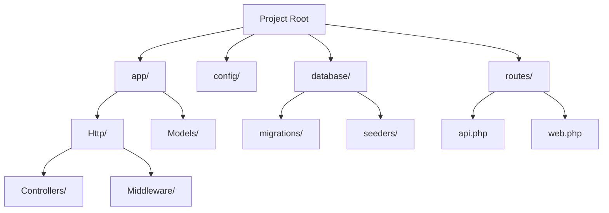
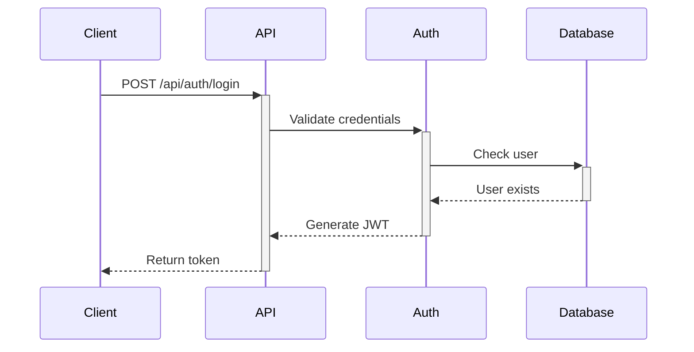
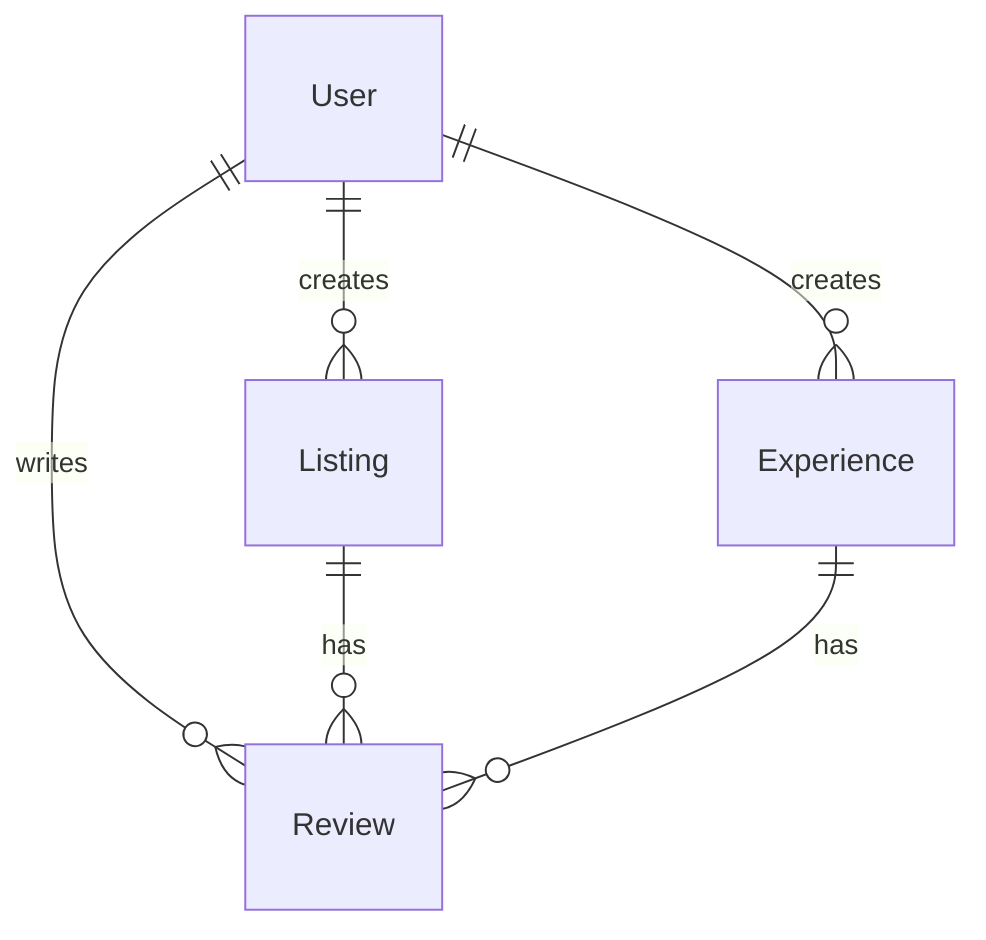

# Triply Architecture

## Project Structure

```mermaid
graph TD
    A[Project Root] --> B[app/]
    B --> C[Http/]
    B --> D[Models/]
    C --> E[Controllers/]
    C --> F[Middleware/]
    
    A --> G[config/]
    A --> H[database/]
    H --> I[migrations/]
    H --> J[seeders/]
    
    A --> K[routes/]
    K --> L[api.php]
    K --> M[web.php]
```

## Authentication Flow

```mermaid
sequenceDiagram
    Client->>+API: POST /api/auth/login
    API->>+Auth: Validate credentials
    Auth->>+Database: Check user
    Database-->>-Auth: User exists
    Auth-->>-API: Generate JWT
    API-->>-Client: Return token
```

## Database Schema

```mermaid
erDiagram
    User ||--o{ Listing : creates
    User ||--o{ Experience : creates
    User ||--o{ Review : writes
    Listing ||--o{ Review : has
    Experience ||--o{ Review : has
```